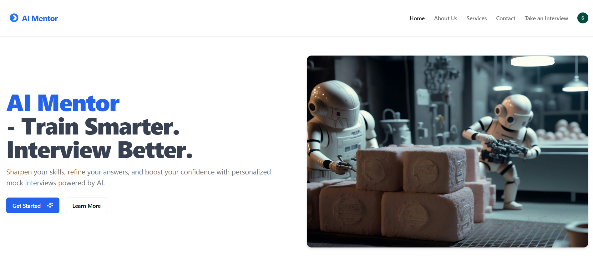
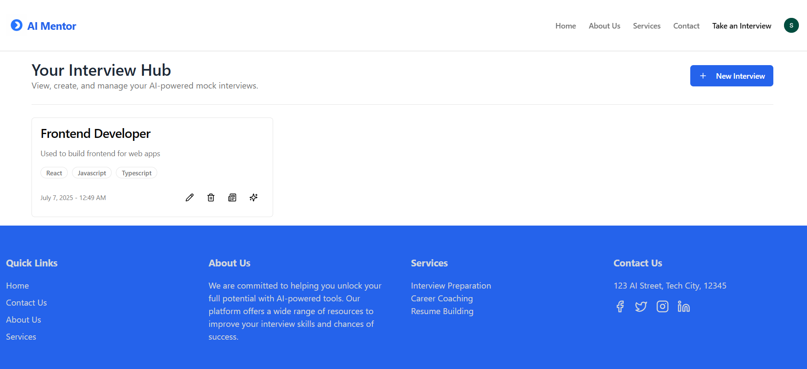
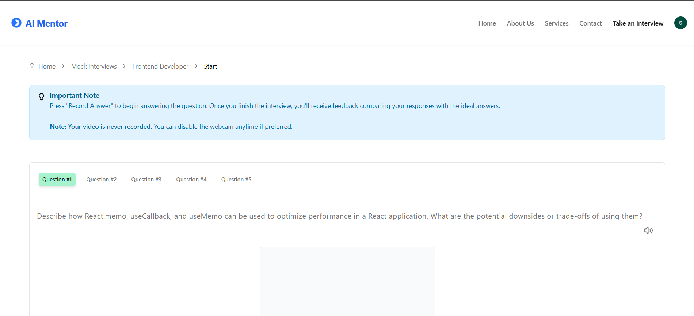

# 🧠 AI Mentor – AI Mock Interview App

**AI Mentor** is a smart interview preparation platform that uses AI to simulate mock interviews, giving users personalized practice to boost confidence and job readiness. From real-time question generation to a sleek dashboard and analytics, it's your interview training partner – powered by AI.

---

## 🚀 Features

- 🎤 **AI-powered Interview Simulation**  
  Get personalized, role-specific questions using real-time AI generation.

- 📄 **Answer Drafting & Tracking**  
  Write, revise, and track your mock responses easily.

- 📊 **Dashboard Overview**  
  Manage, review, and revisit your past interviews anytime.

- 🔐 **Secure User Authentication**  
  Auth system powered by [Clerk](https://clerk.dev) to manage user sessions.

- ☁️ **Realtime Database**  
  Interview data is stored securely with [Firebase Firestore](https://firebase.google.com/docs/firestore).

---

## 🧑‍💻 Tech Stack

| Category     | Tools Used                                   |
|--------------|----------------------------------------------|
| Frontend     | React, TypeScript, Vite                      |
| UI Framework | Shadcn UI, TailwindCSS                      |
| Auth         | Clerk                                        |
| Database     | Firebase Firestore                          |
| Icons        | Lucide React                                 |
| Utilities    | React Router, Zod, React Hook Form, Sonner   |

---

## 📸 Screenshots

### 🔷 Home Page


### 📁 Dashboard


### 🧪 Interview Page


---

## 📦 Getting Started

1️⃣ Clone the Repository

```bash
git clone https://github.com/LokaGreeshma391/AI-Mock-Interview-App.git
cd AI-Mock-Interview-APP
```
2️⃣ Install Dependencies
```bash
npm install
```
3️⃣ Set Up Environment Variables
Create a .env file in the root and add:
```bash
VITE_CLERK_PUBLISHABLE_KEY=your-clerk-key
VITE_FIREBASE_API_KEY=your-firebase-key
VITE_FIREBASE_AUTH_DOMAIN=your-auth-domain
VITE_FIREBASE_PROJECT_ID=your-project-id
VITE_FIREBASE_STORAGE_BUCKET=your-bucket
VITE_FIREBASE_MESSAGING_SENDER_ID=your-messaging-id
VITE_FIREBASE_APP_ID=your-app-id
```

## 📈 Future Improvements

📊 Performance analytics per category

📅 Interview scheduling system

📥 Resume parsing + question suggestions

## 📬 Contact

👩‍💻 Developed by: Greeshma Loka

📧 Email: lokagreeshma7@gmail.com

🌐 GitHub: LokaGreeshma391

## 📄 License
Licensed under the MIT License
